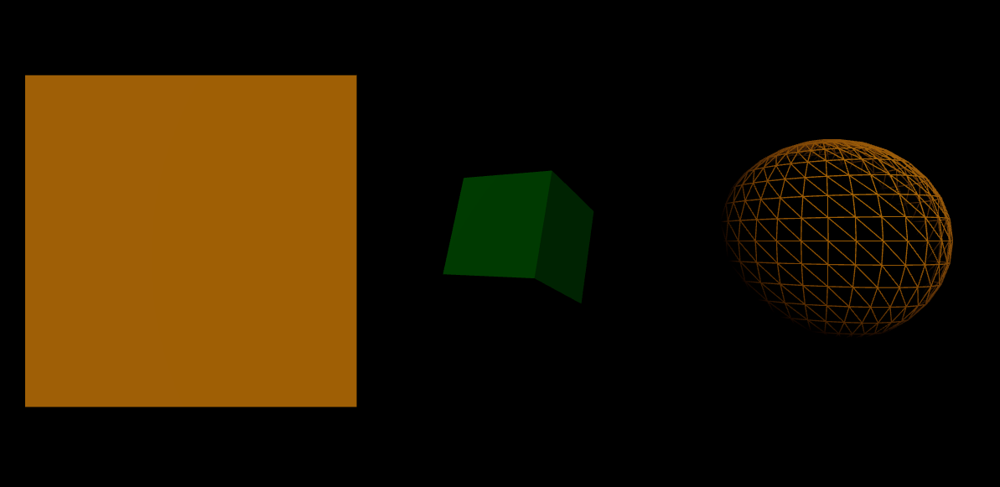

# React + Vite

Lesson 1: Create Box element and light without using React Components and props

Lesson 2: Create Box element using React component and props

Lesson 3: Create Animation using useFrame() hook in Box Component.

Lesson 4: Create Interaction with Sphere. 1. Change color and animation speed when mouse is hover. 2. Change size when mouse is clicked. 

